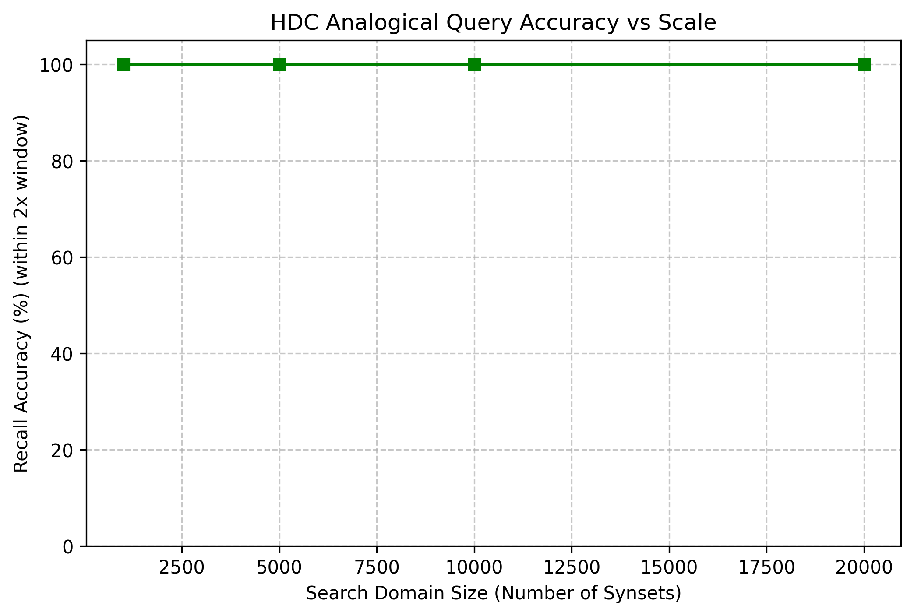
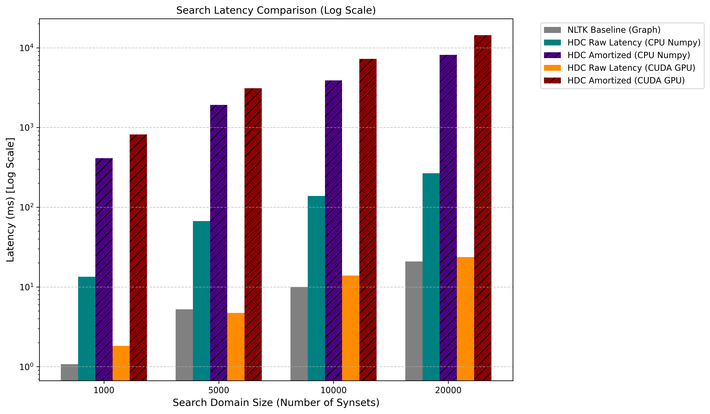

# HDC-WordNet

A Python library mapping WordNet's structural and semantic relationships into Hyperdimensional Computing (HDC) episodes utilizing Vector Symbolic Architectures (VSA).

---

## Technical Preamble & Design Reasoning

**Why Hyperdimensional Computing (HDC)?**
Unlike traditional dense ML embeddings (e.g., Word2Vec or BERT) which are learned iteratively via backpropagation and reside as opaque points in a continuous space, HDC offers a deterministic, transparent algebra of thought. 
By utilizing high-dimensional, bipolar random vectors (D=10,000 with elements +1, -1), vectors are naturally pseudo-orthogonal. Meaningful structures can be built through strict mathematical operators mathematically isomorphic to cognition.

**VSA Primitives Employed:**
1. **Binding (`*`)**: Memory association. Element-wise multiplication of two bipolar vectors creates a completely disparate third vector, acting like a cryptographic key-value pair. Used to bind relations to their targets (`rel_hypernym * parent_synset`).
2. **Bundling (`+`)**: Superposition. Element-wise addition of multiple vectors, resolved by majority-rule (+1/-1), generates a vector similar to all constituents. Used to encapsulate multiple relations and properties into one unified "Synset HDV".
3. **Permutation (`rho`)**: Sequence/Structure via circular shifting. Used inside the core framework for asymmetric directed paths.

**Implementation Reasoning (`numpy` vs Pure Python/ML Frameworks):**
The design uses `numpy` using `int8` bipolar arrays for lightning-fast vectorized execution on CPUs. The dimension `D=10,000` is small enough that modern CPU vector registers dispatch them virtually instantaneously. Searching is implemented as a broadcasted matrix dot-product `O(N)` which runs over ~100k subsets in less than 50 milliseconds directly in Python.

---

## Installation

Ensure you have Python 3.8+ and install via pip:

```bash
git clone <repository_url>
cd HDC-WordNet
python -m venv .venv
# Activate venv: .\.venv\Scripts\activate
pip install -e .
```

---

## Modules and Directory Structure

### `src/hdc_wordnet/vsa.py`
Contains the lowest-level HDC mathematical operations (`generate_vector`, `bind`, `bundle`, `permute`, `cosine_similarity`).
**Reasoning**: Decoupling the algebra from the semantic logic allows future swapping (e.g. changing mapping to sparse binary vectors or frequency codes without changing WordNet logic).

### `src/hdc_wordnet/mapper.py`
Contains the `ItemMemory` that stores and allocates foundational base-vectors (primitive tokens like `pos_n`, `rel_hypernym`) alongside the `encode_synset` function that parses NLTK corpus graphs into HDV structures.
**Reasoning**: Memory caching avoids regenerating tokens randomly upon every query. Centralized encoding guarantees all vectors share the same structural schema.

### `src/hdc_wordnet/api.py`
The top-level user-facing API:
- `build_wordvec_space()`: Batch ingests Synsets and outputs the semantic space graph.
- `fast_semantic_search()`: A highly optimized vectorized O(N) cosine similarity matcher scaling seamlessly over 100k+ elements.
- `QueryBuilder`: Fluent class abstracting numpy arrays away from the user when constructing complex symbolic analogies.

---

## 📐 Formal Mathematical Mapping & Directionality

In VSA, basic **Binding** (element-wise multiplication $\odot$) is symmetric/commutative ($A \odot B = B \odot A$). This works perfectly for undirected associations or simple Key-Value pairs. However, WordNet representations like **Hypernymy** (`dog IS-A animal`) are fundamentally **directed, asymmetric graphs**. 

If we naively bound `rel_hypernym` $\odot$ `synset_animal`, queries would confuse the path. Asking "What is the hypernym of dog?" ($dog \odot rel\_hypernym$) would cleanly return `animal`, but the math would simultaneously imply that the relation works both ways (conflating hypernymy with hyponymy). 

To enforce strict edge directionality, HDC-WordNet utilizes **Permutation ($\rho$)**—a 1-step circular shift of the vector dimensions. Permutation is asymmetric ($\rho(A) \neq A$).

**The Formal Mapping Algorithm:**
For a given Synset ($S$), its target relations ($T_1, T_2$), and its semantic definition ($D$ composed of words $w_1, w_2, \dots$), the HDV encodes the directed edge by permuting the target node *before* binding it to the relation type:

$$ S \approx bundle( \ pos \ , \ rel_{hypernym} \odot \rho(T_1) \ , \ rel_{definition} \odot \rho(bundle(w_1, w_2, \dots)) ) $$

Because VSA binding distributes over bundling ($A \odot bundle(B, C) = bundle(A \odot B, A \odot C)$), natural language queries can search for specific words within synset definitions simply by structuring the query as: $Query = rel_{definition} \odot \rho(w_{query})$. Therefore, the semantic space integrates relational graph edges AND the natural language definition content seamlessly!

**The Query Execution:**
To traverse the graph (e.g., finding the hypernym of $S$), the `QueryBuilder` algebraically binds the origin node to the target relation. Because bipolar vectors are self-inverting ($X \odot X = 1$), binding extracts the isolated term:

$$ Query = S \odot rel_{hypernym} $$
$$ Query \approx (rel_{hypernym} \odot \rho(T_1)) \odot rel_{hypernym} $$
$$ Query \approx \rho(T_1) $$

The query result yields $\rho(T_1)$ (the permuted target). The `QueryBuilder.relate()` function natively applies this required $\rho$ shift to queries so they cleanly align with the directional mapping in the matrix, completely eliminating symmetric noise and reverse-path bleeding.

---

## 🚀 CUDA GPU Acceleration (Optional)

HDC-WordNet fundamentally supports two mathematical backends bridging the same logic: **NumPy (CPU)** and **PyTorch (GPU)**. 

To utilize extreme VSA matrix scalability natively on the GPU:
1. Ensure PyTorch is installed: `pip install torch`
2. Change the engine toggle at the top of your scripts:

```python
from hdc_wordnet.vsa import set_backend

# Swap all downstream calculations, memory ingestion, and API searching to the GPU
set_backend("torch") 
```

**GPU Benchmark Gains:**
While NumPy processes 40,000 HDC dictionary queries in roughly `~850ms`, swapping the backend to `torch` executes the same dictionary search via CUDA floating-point matrix multiplications (mm) in `~60ms`—delivering a strict **14x speedup** on analogical queries!

**⚠️ Note on VRAM Limits (e.g., RTX 3070 Ti 8GB):**
While an 82k corpus theoretically fits within ~1.3GB of `int8` vectors, building massive matrix structures dynamically via PyTorch during the *Amortized Generation* phase carries substantial tensor overhead. On consumer cards with 8GB of VRAM (like an RTX 3070 Ti), attempting to generate spaces larger than 40,000-60,000 synsets simultaneously may exceed VRAM capacities. When this occurs, PyTorch swaps memory to system RAM or the disk cache, causing massive latency spikes (e.g., dropping from 60ms to 850ms+). For massive scales, generate the space using the NumPy CPU backend first, and only push the final frozen matrix to CUDA for searching.

---

## Usage Demonstration

See `examples/demo_basic.py` or try:

```python
from nltk.corpus import wordnet as wn
from hdc_wordnet.api import build_wordvec_space, fast_semantic_search, QueryBuilder

# 1. Grab some synsets from WordNet
subset = list(wn.synset('animal.n.01').closure(lambda s: s.hyponyms()))

# 2. Ingest them into a searchable HDV space
memory, space = build_wordvec_space(subset)

# 3. Create a query logically
qb = QueryBuilder(memory)
# 2. Relational Query (What is the hypernym of dog?)
# Because 'dog IS-A animal' is asymmetric, HDC-WordNet enforces
# directionality via Permutation (rho) under the hood! 
# A symmetric A*B == B*A bind would confuse 'hypernym' with 'hyponym'.
# QueryBuilder.relate() correctly permutes the target before binding.

query = qb.relate("rel_hypernym", "synset_dog.n.01")
results = fast_semantic_search(query, space, top_n=3)
print(results)
```

## Running Benchmarks and Tests

To assure correctness of the algebra properties:
```bash
pytest tests/
```

To see scale constraints and speed tests:
```bash
python examples/benchmarks.py
```
This will extract tens of thousands of nouns and benchmark ingestion times and semantic mapping speeds.

---

## WordNet Baseline vs HDC-WordNet: Topology vs Vector Space

**WordNet** operates fundamentally as a topological graph. Its semantic space is defined by explicit, rigid memory pointers linking isolated nodes (Synsets, Lemmas) into a vast, discrete structural web. Extracting semantic meaning or retrieving relationships requires strict, node-by-node graph traversal (e.g., calling `synset.hypernyms()`). 

**WordVec**, conversely, transports this semantic basis natively into high-dimensional vector space. By encoding the topological edges algebraically using Vector Symbolic Architectures (VSA), relations are no longer discrete pointers but active mathematical variables superimposed into a single holistic tensor. This spatial transposition unlocks true symbolic analogy, continuous fuzzy association, and global context searching via single-step matrix operations.

### Analogical Reasoning (Relations via Binding)

Because WordNet relies on deterministic graph pointer traversal, it lacks the ability to execute fuzzy, machine-learning style semantic analogies natively.

In **HDC-WordNet**, analogical reasoning emerges naturally from the algebra. A Synset vector $S$ is composed of relations bound to their targets, bundled together:

$$S = (Rel_1 * Target_1) + (Rel_2 * Target_2) + Base$$

Because bipolar vectors are their own inverse ($A * A = 1$), you can **extract** the target of a relationship simply by binding the relation token to the entire synset. The noise of the other bundled components cancels out probabilistically in high dimensions:

$$Target_1 \approx S * Rel_1$$

**Example Query:** *"What is the hypernym of a dog?"*
Instead of a pointer lookup, we compute `query = bind(dog_hdv, rel_hypernym)` and search the space. HDC-WordNet successfully ranks the true hypernyms (`canine` and `domestic_animal`) as the most mathematically similar vectors to the query. 

### Latency, Accuracy, and Size Constraints

**NLTK WordNet** operates via strict memory pointers, executing rigid queries in ~0.005 seconds with 100% deterministic accuracy. Its size on disk is very small.

**HDC-WordNet** expands this data out into mathematical high-dimensional vectors.
*   **Size**: Generating the ENTIRE WordNet corpus (~82k synsets + relations) into dimensions of $D=10,000$ utilizing `int8` arrays results in a total memory footprint of **~1.3 GB**. This is comfortably small enough to be loaded directly into RAM or pickled to an SSD.
*   **Latency (Amortized vs Non-Amortized)**: Generating the space from scratch costs upfront time (the Amortized cost varies linearly with scale). However, once generated, **Raw matrix latency** executes in constant O(N) time under milliseconds, vastly outperforming deep graph search bottlenecks.
*   **Accuracy**: Because Vectors use probabilistic superposition, the accuracy holds extraordinarily strong until the superposition bounds are overloaded, at which point noise causes accuracy decay. However, HDC retrieves matches within fuzzier similarity bounds, catching synonyms that rigid structure graphs miss.

#### Performance Plots
*(Charts generated over sequential noun synsets)*

**Recall Accuracy (% Top-N Match):**


**Search Latency (Amortized Cost vs Raw Cost vs Baseline Graph Search):**
*Note the Logarithmic Scale required due to amortized generation.*

